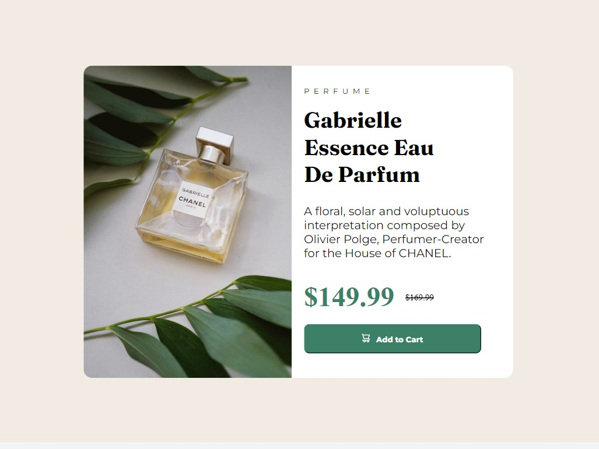

# Frontend Mentor - Product preview card component solution

This is a solution to the [Product preview card component challenge on Frontend Mentor](https://www.frontendmentor.io/challenges/product-preview-card-component-GO7UmttRfa). Frontend Mentor challenges help you improve your coding skills by building realistic projects. 

## Table of contents

- [Overview](#overview)
  - [The challenge](#the-challenge)
  - [Screenshot](#screenshot)
  - [Links](#links)
- [My process](#my-process)
  - [Built with](#built-with)
  - [What I learned](#what-i-learned)
  - [Continued development](#continued-development)

- [Author](#author)
- [Acknowledgments](#acknowledgments)

**Note: Delete this note and update the table of contents based on what sections you keep.**

## Overview
Amazing project, Am  really learning alot

### The challenge

Users should be able to:

- View the optimal layout depending on their device's screen size
- See hover and focus states for interactive elements

### Screenshot




### Links

- Solution URL: [(https://github.com/Victoryruro/frontend-mentor-2)]
- Live Site URL: [(https://victoryruro.github.io/frontend-mentor-2/)]

## My process
Started with HTML to get the skeleton of the page , then process to styling with CSS . I styled the desktop design first then the mobile design.

### Built with

- Semantic HTML5 markup
- CSS custom properties
- Flexbox


### What I learned


I learnt the unset value to be very important in web responsiveness


```html
<div>Some HTML code I'm proud of</div>
```
```css
.img .secondimg {
  display: unset;
}
```


### Continued development

I would love to develop my flex skills and CSS skills in general


## Author


- Frontend Mentor - [@Victoryruro](https://www.frontendmentor.io/profile/Victoryruro)
- Twitter - [@vicruro](https://www.twitter.com/vicruro)


## Acknowledgments


I love to appreciate Almighty God for his mercies 
